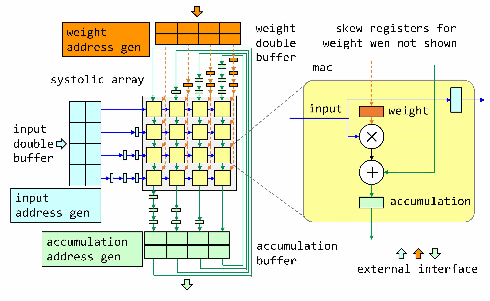
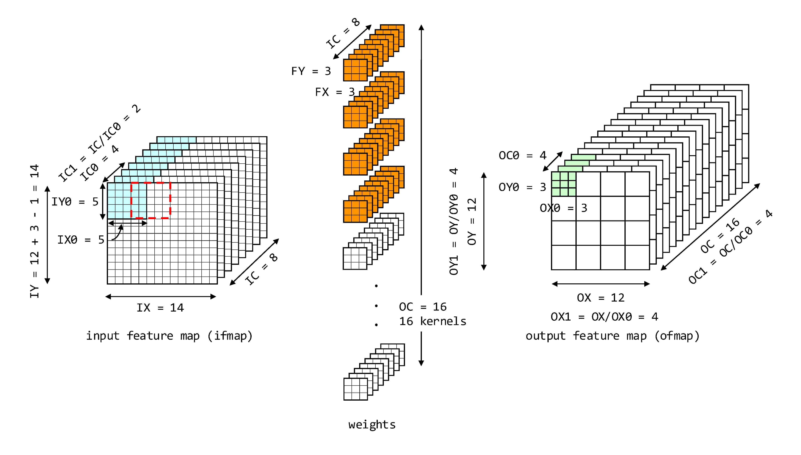
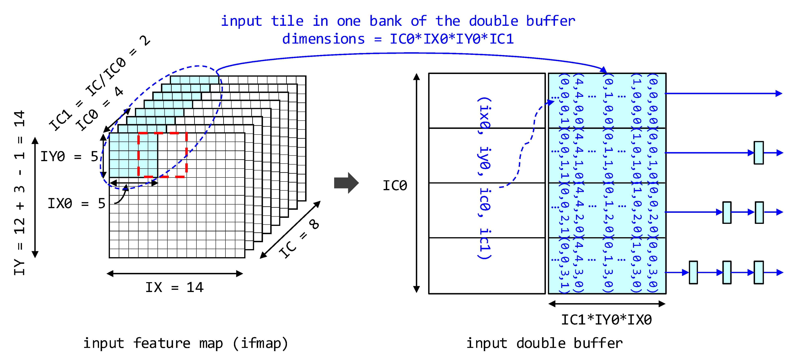
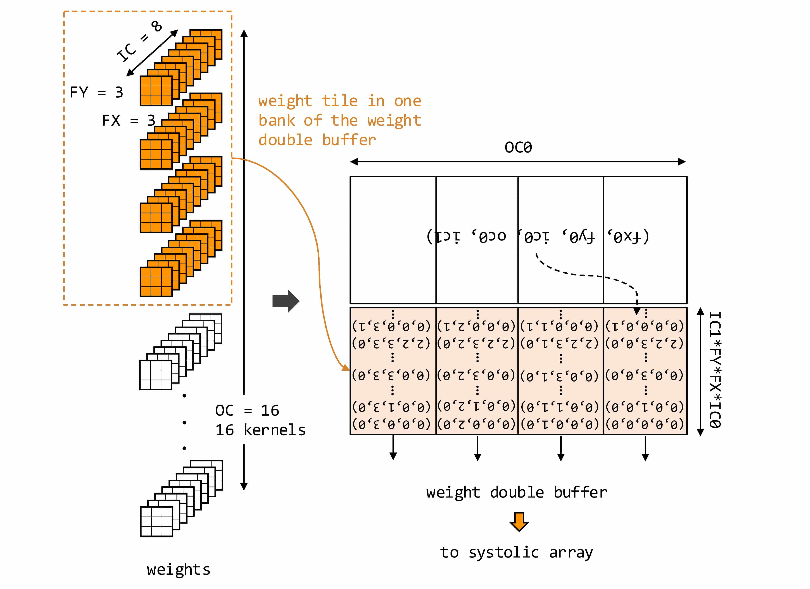
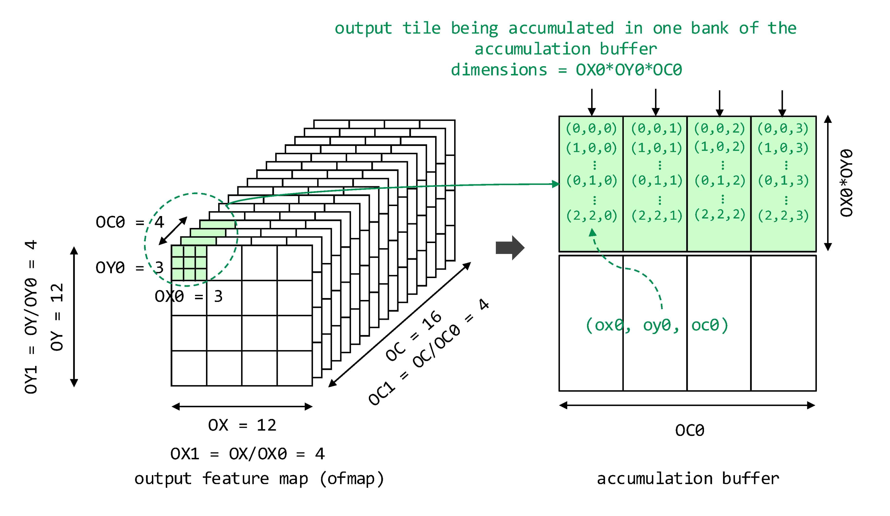
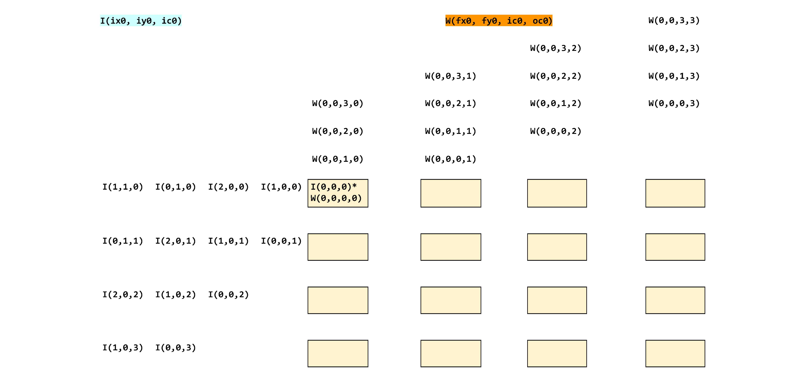
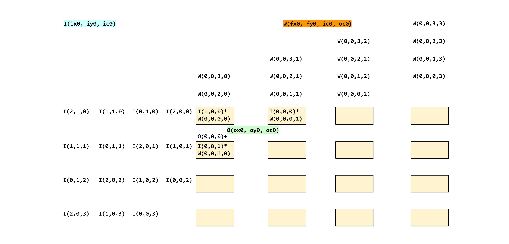
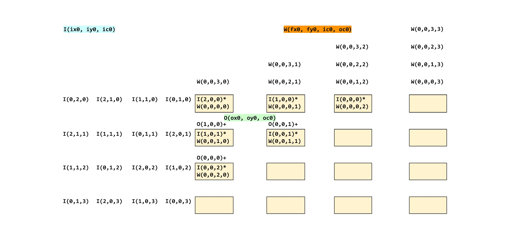
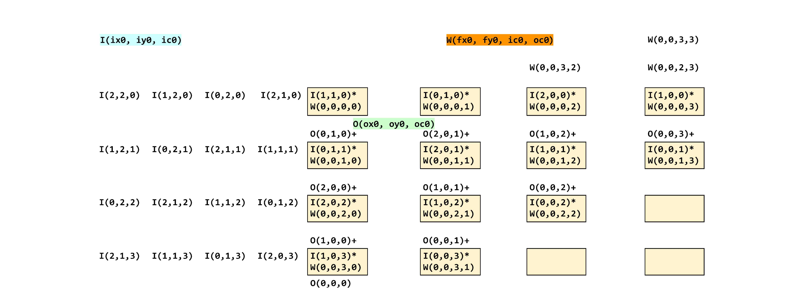
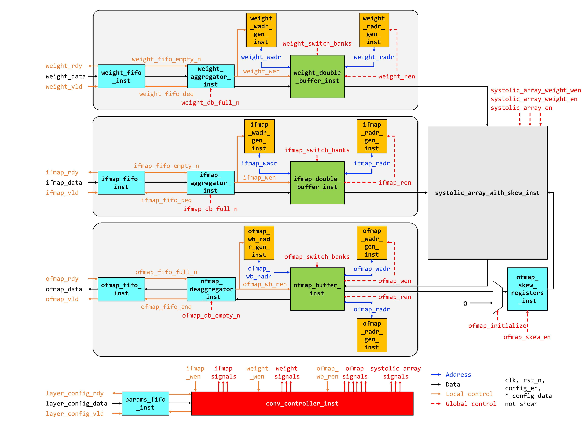

# HW 2: CNN Accelerator (Unit Design & Test)

EE 599: Special Topic on Complex Digital ASIC System Design, Fall 2023  

## 1. Introduction

This homework is from Stanford University EE272 Homework 2 Spring 2023. In this homework, you will design and test the constituent blocks of a convolutional neural network (CNN) accelerator. To check for correctness of the individual blocks you will also be responsible for writing “unit” tests in the form of either directed tests  or random tests. You will write random tests using UVM-style SystemVerilog. The code repository for this homework is at: [https://github.com/usc-chips/ee599-hw2-fall2023.git](https://github.com/usc-chips/ee599-hw2-fall2023.git).

**One of the key points you must takeaway from this class is that design and testing always go hand in hand. If you write a module, you must also write its test, and in many cases you must write the test first, so that as soon as your test passes you know you are done. It is a good practice to build up your large design from small blocks, that you first unit test, and once they are correct, integrate them to create your larger design and test it. This will greatly reduce the time you spend in debugging your integrated design, and make it easier to isolate issues. It will also make your project easier to maintain.**

## 2. Golden C++ Model

We will start with the golden model. Developing a golden model is a good step in under- standing the application. You can think of the golden model as the software reference design that defines the expected functionality of the hardware. Specifically, to develop a neural network accelerator that can run convolutional (CONV) layers, the golden model needs to precisely perform the computation of CONV layers, so that we can later check the correctness of the hardware design by comparing the hardware results with the golden model results.

### 2.1 CONV Layer

You need to implement a parameterized CONV layer in the file `cpp/conv_gold.cpp`. The parameterized CONV layer should support various layer configurations, such as different input sizes, filter sizes, and strides. However, you don’t need to consider padding for this homework. In other words, the output feature map is smaller than the input feature map. The expectation is that the inputs will be appropriately padded before getting passed into the accelerator; we make this assumption simply to reduce the complexity of the hardware you are designing.

To test the correctness of your code, we provide multiple example input vectors, which serve as input feature maps and weights for some of the ResNet layers. These are in the data folder. For example, layer1 ifmap.txt and layer1 weights.txt contain the input feature map and weights of the first ResNet layer. The reference output vectors are also provided to verify the golden model you write, such as layer1 gold *ofmap.txt*.

Once you have completed your coding in conv gold.cpp, you can test your code using the following commands.

> % make run_conv_gold_test

These compile and run your gold model with the tester in `conv_gold_test.cpp`, which simply loads the input vectors, uses your model to do convolution and compares the outputs with our outputs. If your code is incorrect, you will see error messages.

### 2.2 Tiled CONV Layer

Additionally we would like you to implement a parameterized, tiled CONV layer in the file `cpp/conv_gold_tiled.cpp`. The parameterized CONV layer should support various layer configurations, such as different input sizes, filter sizes, and strides and the order of the loops from outer to inner should be: OY1, OX1, OC1, IC1, FY, FX, OY0, OX0, OC0, IC0. This function should produce the same ofmap as the one above. Keep in mind your accelerator will use the exact same tiling and you will use this test to verify the output of your accelerator.

Once you have completed your coding in `conv_gold_tiled.cpp`, you can test your code using the following commands.

> % make run_conv_gold_tiled_test

## 3.  CNN Accelerator Architecture

Before you dive deep into implementation, you must first think about the high-level architecture of your system. More concretely, it means first figuring out what the major modules/blocks in your design are, and how they are connected hierarchically. At this stage it is helpful to draw a block diagram of your system. For large designs, you would repeat this process for all the key sub-modules in the design. Since we are short on time, we provide you an example high-level architecture of the CNN accelerator as a starting point. You will first design and test the blocks of the CNN accelerator in this homework. Figure 1 shows the block diagram of a simple CNN accelerator with a 4 × 4 systolic multiply-accumulate (MAC) array. The size of 4 × 4 is just to make the illustration compact; you must make your implementation parameterized on the array size, so you can easily experiment with different sizes later.



- Figure 1: CNN accelerator block diagram

The CNN accelerator consists of a 2D systolic array of MAC units. As shown in Figure 1 (right), each MAC unit receives an input pixel from the left, it multiplies it with the weight stored in its weight register and adds the result to the partial accumulation it receives from the top. It stores the new sum in the accumulation register and forwards it to the bottom. It also stores the incoming input pixel in a register and forwards it to the right. Note that wires and modules carrying inputs are shown in blue, those carrying weights are shown in orange and ones that have partially accumulated outputs are shown in green in Figure 1. The systolic array receives input pixels from the input double buffer. These are skewed using a set of registers. Similarly, the array receives weights from the weight double buffer, and it stores the partially accumulated outputs in the accumulation buffer. The accumulation and weight values are also skewed with registers. The need for skewing is discussed in the next few paragraphs. The double buffers are fed from the accelerator’s external interface.

### 3.1 Simplifying Assumptions

Before we describe the flow of data through the array, we will make some simplifying assumptions.

- Assume that you are using IC|OC (or C|K) spatial unrolling, meaning that you are unrolling input channels along the vertical axis of the array and output channels along the horizontal axis of the array. 

- Further, assume that the loop ordering is also fixed (this is just to make the hardware design simpler. The loop ordering for this homework is:

```
 # DRAM level below: 
 for oy1=[0:OY/OY0)
   for ox1=[0:OX/OX0) 
     for oc1=[0:OC/OC0)
       # Double buffer level below: 
       for ic1=[0:IC/IC0)
         for fy=[0:FY)
           for fx=[0:FX) 
             for oy0=[0:OY0)
               for ox0=[0:OX0) 
                 # Register file level below: 
                 parallel_for oc0=[0:OC0): # Unroll over array width 
                   parallel_for ic0=[0:IC0): # Unroll over array height
```

- Assume that the batch size (IN) is 1.

### 3.2 Dataflow Through Accelerator

The loop unrolling and ordering determines the order in which we write and read the input array from the input double buffer, the weights array from the weight double buffer and the partial outputs from the accumulation buffer. We choose an ordering which makes the addressing logic of the double buffers simple. Let us consider an example small layer with 0X = 12, OY = 12, FX = 3, FY = 3, IC = 8, OC = 16, STRIDE = 1, ON = 1 as shown in Figure 2. We are using the following schedule for this layer with the same loop ordering as described earlier:



- Figure 2: Example layer with 0X = 12, OY = 12, FX = 3, FY = 3, IC = 8, OC = 16, STRIDE = 1, IN = 1 and its schedule. The blue, orange and green colored pixels represent one (the first) tile of inputs, weights and outputs residing in one bank of their respective double buffers. Please understand this numeric example very carefully.

The following pseudo-code is also the numeric version of the code block in part 3.1:

```
 # DRAM level below: 
 for oy1=[0:4)
   for ox1=[0:4) 
     for oc1=[0:4)
       # Double buffer level below: 
       for ic1=[0:2)
         for fy=[0:3)
           for fx=[0:3) 
             for oy0=[0:3)
               for ox0=[0:3) 
                 # Register file level below: 
                 parallel_for oc0=[0:4): # Unroll over array width 
                   parallel_for ic0=[0:4): # Unroll over array height
```

We are unrolling IC by 4 along the vertical axis of the 4 × 4 array, and OC by 4 along the horizontal axis of the array. The schedule tiles the output feature map, in blocks of 3×3×4 pixels (OX0 = 3, OY0 = 3, OC0 = 4), which means there are 4×4×4 blocks in total along OX, OY and OC (OX1 = 4, OY1 = 4, OC1 = 4). It is important to note that to compute 3×3 output blocks we need 5 × 5 input blocks, since we are convolving with a 3 × 3 kernel. This also means that there is overlap between the input blocks along IX and IY dimensions. We still load 4 blocks along IX and 4 blocks along IY, but neighboring blocks overlap by 2 pixels on each side as shown by the red dotted square in Figure 2.

#### 3.2.1 Input Double Buffer



- Figure 3: Order of input feature map pixels in the input double buffer. The size of input tile in one bank of the double buffer is IC0 × IX0 × IY0 × IC1.

Figure 3 shows the input double buffer. It also shows the set of pixels that form one (the first) tile residing in one bank of the input double buffer. Each input tile has IC0 × IX0 × IY0 × IC1 pixels. The pixels along IC0 are accessed in parallel—the access width of the input double buffer is IC0 × (number of bits in an input pixel). The order of pixels residing in the input double buffer follows from the loop ordering in the schedule: IX0 first, then IY0, and then IC1. The pixels in the tile are first reused FX × FY times, and then reused OC1 times.

#### 3.2.2 Weight Double Buffer

Figure 4 shows the weight double buffer. Each weight tile has IC0 × OC0 × FX × FY × IC1 entries. From this tile, IC0 × OC0 weights are loaded into the systolic array at a time, and these are reused OX0 × OY0 times. From the tiled loop nest the order of loading of weight tiles is: first along OC1 (innermost loop), then weights are reloaded for OX1 and OY1.



- Figure 4: Order of weights in the weights double buffer. The size of weight tile in one bank of the double buffer is IC0 × OC0 × FX × FY × IC1.

#### 3.2.3 Accumulation Buffer

Figure 5 shows the accumulation buffer. This is also a double buffer—meaning it has two banks. However, each bank is dual-ported, you can read and write to it at the same time. This is necessary because the systolic array both writes the partial sums into the bank, as well as reads them back out to accumulate further at the same time. The tile of partial sums residing in one bank of the accumulation buffer has OC0 × OX0 × OY0 entries, and OC0 entries are accessed in parallel. Each element in the output tile is reused (accumulated upon) FX × FY × IC1 times. From the tiled loop nest, the order of processing of output tiles is: first along OC1 (innermost loop), then along OX1 and finally along OY1.



#### 3.2.4 Dataflow Through Systolic Array 

The following figures illustrate how the systolic array works. Once the input and weight double buffers are filled with one block/tile of data, in the first cycle, one row of weights is read from the weight double buffer and skewed. The weight register of the top-left MAC gets written as shown in Figure 6. At the same time, the first row of input pixels is read from the input double buffer. Because of skewing, the top pixel immediately appears at the top-left MAC unit, while the one below it arrives one cycle later and so on. So in this first time step the array can compute I(0,0,0) × W(0,0,0,0) to produce partial output O(0,0,0). Figure 7 shows the next time step. Another row of weights is read from the double buffer, skewed, and the weight registers along the diagonal get written. Input pixels get forwarded to the right, and partial outputs get forwarded to the bottom. Figures 8, 9 and 10 show the next 3 time steps. Please study the figures carefully and make sure you understand how the computation is happening before proceeding further. 

The partial outputs coming out of the bottom of the array are deskewed and then stored in the accumulation buffer. Note that each column of the array is working on a different output channel. For a particular output channel, an output pixel must receive contributions from FX × FY × IC input pixels. With the current way of scheduling, in one pass through the array, an output pixel receives only IC0 contributions, as it flows from top to bottom of the array, since only IC0 is unrolled vertically. This means that we have to do another FX × FY × IC / IC0 passes through the array to get the complete output pixel. To enable this, partial outputs are stored in an accumulation buffer, and after one pass through the array, these partial output pixels are read from the accumulation buffer and fed back from the top of the array to get accumulated. Once all accumulations for a block of output pixels are done, the accumulation buffer is flipped (banks are switched), and the completed output tile is sent out of the accelerator. This is shown in Figure 1.



- Figure 6: Systolic array state at time step 1.



- Figure 7: Systolic array state at time step 2.



- Figure 8: Systolic array state at time step 3.


- Figure 9: Systolic array state at time step 4.



- Figure 10: Systolic array state at time step 5.

## 4.  CNN Accelerator Implementation

Given the block diagram, the next step is to decide on the interfaces of all the sub-modules. We have provided these for you. It is important to keep the interfaces as clean and general as possible, so that it is easy to plug in different low-level implementations of the modules (all of which would have the same interface), as well as reuse as much of test infrastructure as possible between different design variants. It is your responsibility to write all of the core modules in Verilog including the MAC, systolic array, double buffers, address generation logic for each buffer and the top level state machine that orchestrates the flow of data through your accelerator to produce the desired outputs.



- Figure 11: Modules in the CNN accelerator.

Figure 11 shows all the modules in your accelerator. It closely matches the earlier architectural block diagram from Figure 1. Please ignore the control part below. You will implement these modules in Verilog. We suggest you start with one block at a time, and use the tests given to check for correct operation. You will be responsible for implementing these blocks:

- MAC Unit
- Systolic Array
- Double Buffer
- Accumulation Buffer
- Sequential Address Generator
- Input Read Address Generator

### 4.1 MAC Unit

Implement the functionality of a scalar multiply-accumulate (MAC) unit in `verilog/mac.v` and test it with `tests/mac_tb.v`. This unit performs one multiply and one accumulate per cycle. It multiplies the current input (ifmap_in) with the stored weight (weight_r) and adds it to the current output (ofmap_in), and the result is stored in the output register (ofmap_r). The input and output registers are only updated if `en` is high. Registered input and output are sent out. If weight `en` is high, then store the incoming weight (weight_in) into the weight register (weight_r). Synchronously reset all registers when rst_n is low.

### 4.2 Systolic Array

This is in `verilog/systolic_array.v` and is tested with `tests/systolic_array_with_skew_tb.v`. It contains two components: a systolic array of MAC units, and registers that skew the weights going into the systolic array. The skew registers are already instantiated, and you should not need to modify this code. There are two sets of skew registers, each instantiated in a triangular pattern as shown in Figure 1. The reason we want to skew the weights is because we want to perfectly overlap the loading of the weights into the systolic array with streaming inputs into the array, and avoid any dead time between two passes through the systolic array that need different weights (at the end of one pass over an OX0 × OY0 tile). The first set (weight_in_skew_registers_inst) skews the weight values. Their input is the module input weight_in, and their output is weight in skewed, which feeds into the systolic array. weight_en controls whether the weights move forward through these registers in any cycle. The second set of registers skews the weight write enable (weight_wen), the signal that indicates whether one should update the weight sitting in the MAC unit’s weight register. Since we skew the weight values, we must also skew the weight write enables by the same amount. This has all been implemented for you, but please read and understand this. 

You must generate a systolic array of MAC units. ifmap_in is the vector of inputs that enters into the left column of MACs, and propagates towards the right. weight_in_skewed (generated in the description above) is the vector of weights that enters into the top row of MACs, and propagates downwards. `weight_wen_w[x][y]` (also generated in the description above) is the weight write enable (the signal that indicates that the weight should be put into the weight register) of the (x, y)th MAC unit. ofmap_in is the vector of partial sums that enters into the top row of MACs and gets accumulated on as it moves downwards. ofmap_out is the vector of partial sums that is the output of last row of MACs, and it also the output of the systolic array. You should make sure that the systolic array is parameterized with respect to ARRAY_WIDTH and ARRAY_HEIGHT. To create this you can use the generate statement (the code for the skew registers shows an example for how to use this statement). The `en` input is the enable that goes into all the MAC units. This module has no registers (state) other than the skew registers already instantiated above. The connections between the MAC units are purely wiring, so make sure you do not introduce any extra state.

### 4.3 Double Buffer

Implement a double buffer with the dual-port SRAM (ram_sync_1r1w) provided. The double buffer source is in `verilog/double_buffer.v`. The dual-port SRAM allows one read and one write every cycle. To read from it you need to supply the address on radr and turn ren (read enable) high. The read data will appear on rdata port after 1 cycle (1 cycle latency). To write into the SRAM, provide write address and data on wadr and wdata respectively and turn write enable (wen) high. You can implement both double buffer banks with one dual port SRAM. Think of one bank consisting of the first half of the addresses of the SRAM, and the second bank consisting of the second half of the addresses. If the switch_banks pulse is sent for one cycle, on the positive clock edge, you need to switch the bank you are reading with the bank you are writing. Internally, you should use a 1-bit register to keep track. You must write two unit tests yourself in `tests/weight_double_buffer_tb.v` and `tests/ifmap_double_buffer_tb.v`, one for weights and one for inputs respectively. The two test benches can have very similar test cases but the goal is to ensure you can set the double buffer parameters correctly to match the size of the input and weight double buffers. You should use the 4 × 4 example array and tiling parameters in part 3.2. Try to use Verilog define and parameter. Assume weights and inputs both use 16 bits.

### 4.4 Accumulation Buffer

Implement an accumulation buffer with the dual-port SRAM (ram_sync_1r1w) provided. The accumulation buffer source is in `verilog/accumulation_buffer.v`. The accumulation buffer is similar to a double buffer, but one of its (logical) banks has both a read port (ren, radr, rdata) and a write port (wen, wadr, wdata). This is used by the systolic array to store partial sums and then read them back out. The other bank has a read port only (ren_wb, radr_wb, rdata_wb). This bank is used to read out the final output (after accumulation is complete) and send it out of the accelerator. This is shown in Figure 11. The reason for adopting two banks is so that we can overlap systolic array processing and the data transfer out of the accelerator (otherwise one operation may stall while the other is taking place). Note: The SRAMs used for both banks will be dual-ported (1r1w), but the logical operation will be as described above where the SRAM that is connected to the array will have both read and write being exercised, and the SRAM connected to the accelerator output will have only its read port being exercised. If the switch_banks pulse is sent, you need to switch the functionality of the two banks at the positive edge of the clock. That means, you will use the bank you were previously using for data transfer out of the chip, for systolic array and vice versa. You must write its unit test yourself in `tests/accumulation_buffer_tb.v`. Assume we use 32 bits for output feature map data.

### 4.5 Sequential Address Generator

This is a sequential address generator which generates a linear sequence of addresses. It is reused for input write, weight write, weight read, output write, output read and output read for writeback. The only difference is what config_block_max is set to in each case. This is the maximum address generated by the address generator (the last address for the block/tile of data), after that it goes back to 0. The sequence of addresses would be: 0, 1, 2, ... , config_block_max, 0, 1, 2 and so on. You need to generate the adr output, but make sure you increment/step the address generator only when adr_en is high. Also reset all registers when rst_n is low. When config_en is high, store the value on config data into config_block_max (this is done initially to configure the address generator to generate the desired sequence, before starting the convolution). The source is in `verilog/adr_gen_sequential.v`. You can test it with `tests/adr_gen_sequential_tb.v`. You should also finish `tests/adr_gen_sequential_tb_uvm.v` to do more tests.

### 4.6 Input Read Address Generator 

This is the read address generator for the input double buffer. It is more complex than the sequential address generator because there are overlaps between the input tiles that are read out. We have already instantiated for you all the configuration registers that will hold the various tiling parameters (OX0, OY0, FX, FY, STRIDE, IX0, IY0, IC1). You need to generate the address output (adr) for the input buffer in the same sequence as the C++ tiled convolution that you implemented. Make sure you increment/step the address generator only when adr en is high. Also reset all registers when rst_n is low. The source is in `verilog/ifmap_radr_gen.v`. You can test it with `tests/ifmap_radr_gen_tb.v`.

|                          | Design Part | File Path                  | Test Part | File Path                                            |
| ------------------------ | ----------- | -------------------------- | --------- | ---------------------------------------------------- |
| CONV Layer (C++)         | **TODO**    | cpp/conv_gold.cpp          | Provided  | cpp/conv_gold_test.cpp                               |
| Tiled CONV Layer (C++)   | **TODO**    | cpp/conv_gold_tiled.cpp    | Provided  | cpp/conv_gold_tiled_test.cpp                         |
| accumulation_buffer      | **TODO**    | accumulation_buffer.v      | **TODO**  | accumulation_buffer_tb.v                             |
| ram_sync_1r1w            | Provided    | ram_sync_1r1w.v            | Provided  | ram_sync_1r1w_tb_uvm.v                               |
| systolic_array           | **TODO**    | systolic_array.v           | -         | -                                                    |
| systolic_array_with_skew | Provided    | systolic_array_with_skew.v | Provided  | systolic_array_with_skew_tb.v                        |
| SizedFIFO                | Provided    | SizedFIFO.v                | -         | -                                                    |
| fifo                     | Provided    | fifo.v                     | Provided  | fifo_tb_uvm.v                                        |
| skew_registers           | Provided    | skew_registers.v           | Provided  | skew_registers_tb.v                                  |
| adr_gen_sequential       | **TODO**    | adr_gen_sequential.v       | **TODO**  | adr_gen_sequential_tb_uvm.v, adr_gen_sequential_tb.v |
| double_buffer            | **TODO**    | double_buffer.v            | **TODO**  | ifmap_double_buffer_tb.v, weight_double_buffer_tb.v  |
| ifmap_radr_gen           | **TODO**    | ifmap_radr_gen.v           | Provided  | ifmap_radr_gen_tb.v                                  |
| mac                      | **TODO**    | mac.v                      | **TODO**  | mac_tb_uvm.v, mac_tb.v                               |

The `fifo_tb_uvm.v` and `ram_sync_1r1w_tb_uvm.v` are for you to learn. The `adr_gen_sequential_tb.v` and `mac_tb.v` are done for you to do some directed tests.

## 5. Testing

Testing is an extremely important part of chip development and quite often takes more time than the design itself. We have already provided several directed or UVM-style tests (described below) for the blocks to get you started. You will write more directed tests and UVM-style tests for some of the blocks.

### 5.1 Directed Tests 

Directed tests are useful for initial testing and corner case testing. For example, when testing a FIFO, you should check some expected pattern of reads and writes as well as what happens to the FIFO when it becomes empty or full. Directed tests can be as simple as an initial block where the control and data signals are altered at each clock edge, and outputs are checked using assertions. For example, we have provided the directed test for the MAC block in `mac_tb.v`. Please add the following directed tests. For the FIFO you already have fully functioning Verilog, so your test should pass. For the other two modules, you are writing both the test and the design, so you will need to debug both.

- `tests/fifo_tb.v`
- `tests/input_double_buffer_tb.v`
- `tests/weight_double_buffer_tb.v`
- `tests/accumulation_buffer_tb.v`

In your report, describe these directed tests. What expected or normal operation did you test? What corner cases did you test?

### 5.2 UVM-style Tests

Besides the code provided, you can also refer to [https://www.chipverify.com/systemverilog/systemverilog-testbench-example-adder](https://www.chipverify.com/systemverilog/systemverilog-testbench-example-adder) to learn how to write UVM-style tests. Please use that style to write these tests:

- `tests/mac_tb_uvm.v `
- `tests/adr_gen_sequential_tb_uvm.v`

In your report, describe these tests. What is the purpose of the different testing blocks (driver, monitor, scoreboard, etc.)? To receive full points for this homework your design should pass all the given tests as well as the tests you have written. Make sure to write your tests within the files allotted so our grading scripts correctly assess them.

### 5.3 Autograder

Before you use vcs to run any SystemVerilog, please run the following command:

> % source setup-ee599.sh

We have provided an autograding script that makes it easier to run your tests. Run the autograder using:

> % python autograder.py

This will run all of the tests that we have provided as well as the tests you are required to implement. Using the option

> % python autograder.py -v

will print the output of each test which will be useful for debugging. If you would like to run an individual test, list each test (or any word that is part of a test’s name) as a command line argument. For example:

> % python3 autograder.py mac adr_gen

will run tests `mac_tb.v` `ifmap_radr_gen_tb.v` and `adr_gen_sequential_tb.v`.

> % python3 autograder.py gold

will run conv gold test.cpp. For a list of possible tests to run, use the command

> % python3 autograder.py list

After you have passed all of the tests, please upload your code to your GitHub repo.


